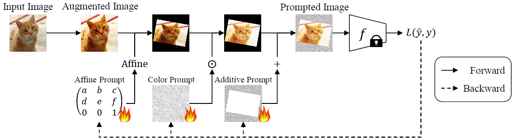

# Enhancing Visual Prompting through Expanded Transformation Space and Overfitting Mitigation
This is a pytorch implementation of the following paper [[NeurIPS]](https://openreview.net/forum?id=kdHz4y1ADc) [[arXiv]](https://arxiv.org/abs/2510.07823):  


Please read license.txt before reading or using the files.  

# Running Experiments

The basic command structure is:
```bash
python main.py --dataset cifar100 --model rn50 --seed 0
```

To aggregate the experimental results, use the following command:
```bash
python collect_results.py --dir save/
```

# Citation

```
@inproceedings{
    enomoto2025enhancing,
    title={Enhancing Visual Prompting through Expanded Transformation Space and Overfitting Mitigation},
    author={Shohei Enomoto},
    booktitle={The Thirty-ninth Annual Conference on Neural Information Processing Systems},
    year={2025},
    url={https://openreview.net/forum?id=kdHz4y1ADc}
}

```
